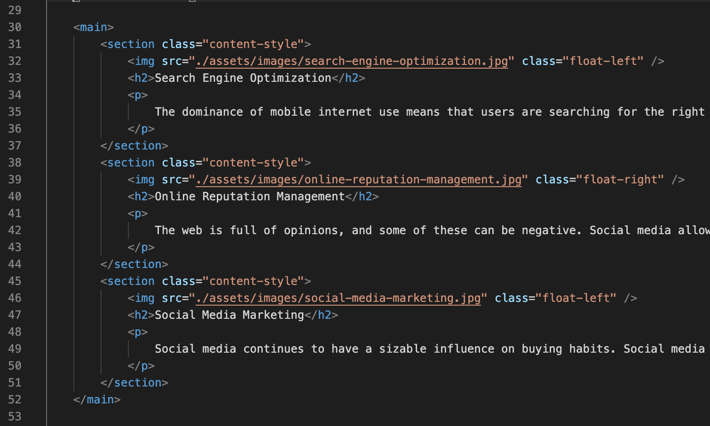
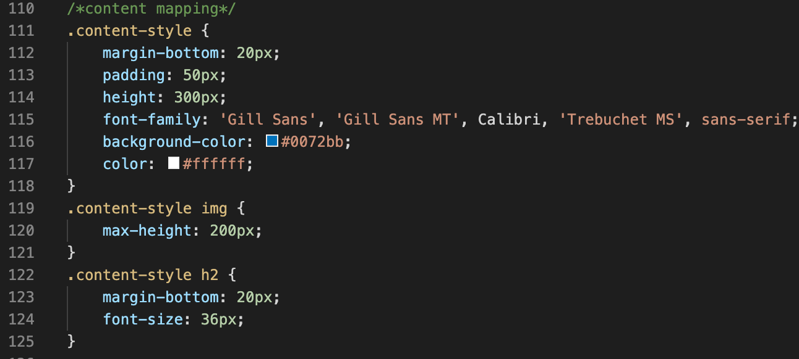
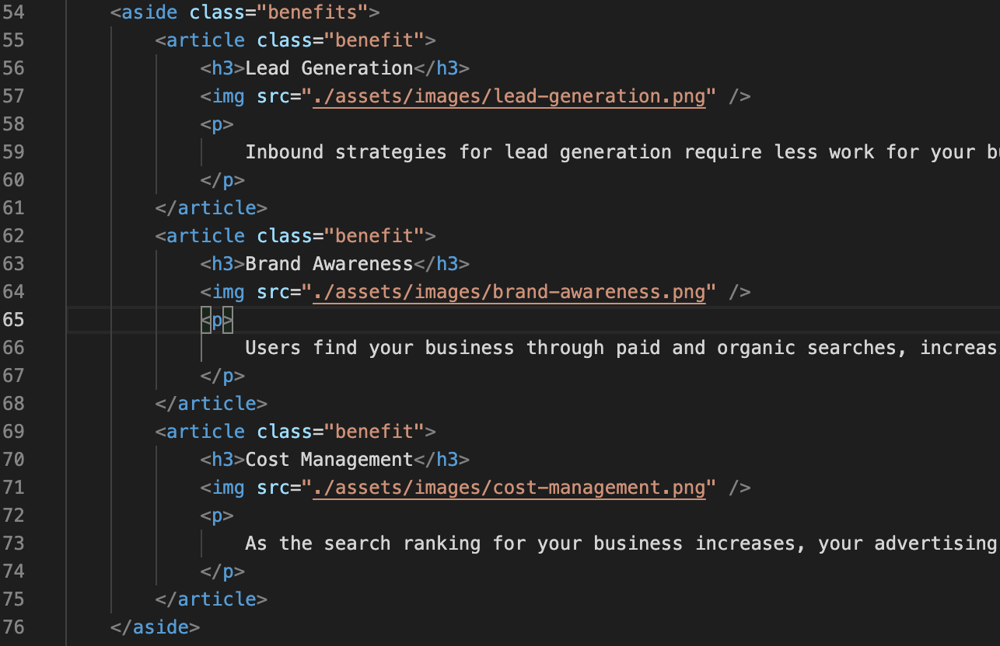
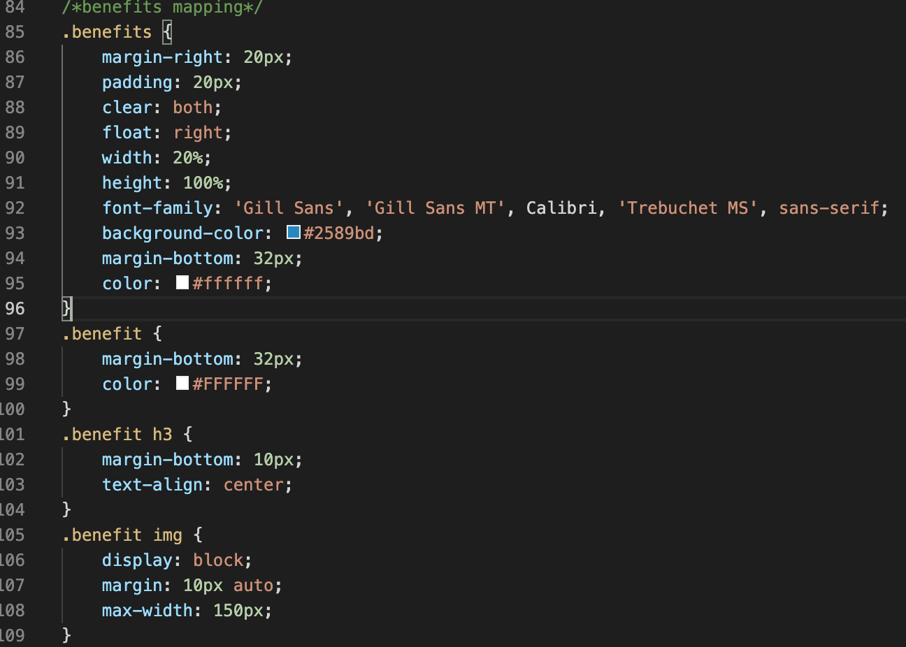

# Homework1: Refactoring Code Project

The purpose of this assignment was to refactor the code for the Horiseon webpage as seen below: 

## Images of changes: Main

The HTML file above captures the changes I made to the main section of the webpage. This portion of the code focuses on changing the tags to be sections in the "main" area, as well as giving each section the same class since they share the same attributes. These changes are also reflected in the CSS file which is linked below: 

## Images of changes: Aside/Article 

The HTML file above captures the changes I made to the aside of the webpage. This portion of the code mimicks the changes I made above: focusing on utilizing more appropriate tags (aside since the contents are not the main - they are on the side) as well as giving each article the same class name since they share the same attributes.  This cuts down on repetitiveness in the CSS file that is linked below: 

## Other

Other changes include:

-adding comments/lables to the CSS file to organize and make the file easier to navigate

-using header, footer, and nav tag(s)

### Links to IO and GitHub:
 https://thompsonel11.github.io/Homework1/

https://thompsonel11.github.io/Homework1/

